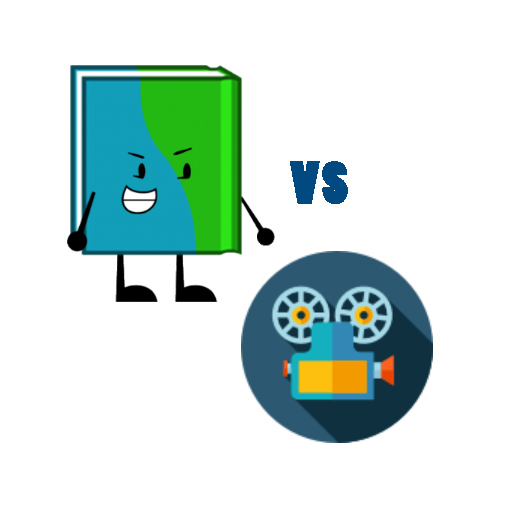

# Book-Versus-Movie
Alexa, open Book versus movie

>Are You a Movie buff, bookworm, or both? Some of these famous titles were books first, and some were films first. Try to guess which is which.

In this game, you will be given a title and you will be asked if the movie of the same title comes first or the book was written before the movie being released. There are certain questions and you can only proceed to the next question when you give the answer. Your score will be saved even after the session being finished, meaning when you will play the game again at the later time, you can resume from the point you left the game. Until the questions exhaust, they will come. You can reset your progress at any time to begin the game from the starting.

* You can ask for rules by saying, "Tell me the rules."
* You can answer the question by saying, "The answer is movie",  if your answer is movie.
* You can ask to repeat the question by saying, "Repeat the question."
* To know your current score, say, "What's my score."
* To reset your progress, say, "Let's play the game from the beginning."

## Available in English(IN)
[Enable it now.](https://alexa.amazon.in/spa/index.html#skills/dp/B07689DDYP/?ref=skill_dsk_res_gw_1)
